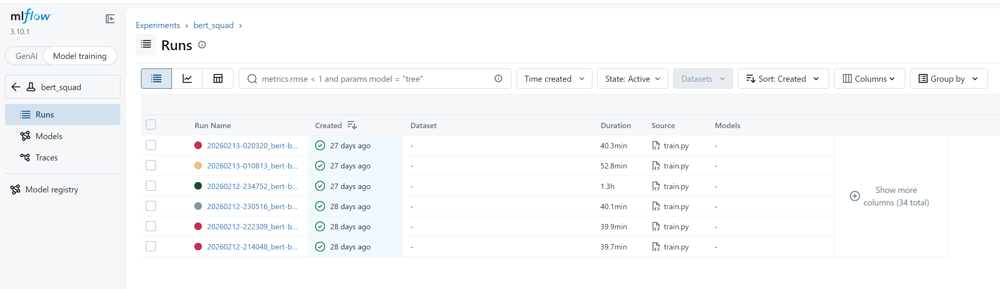
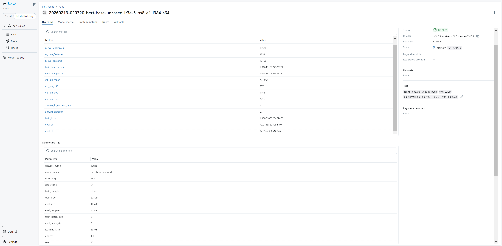
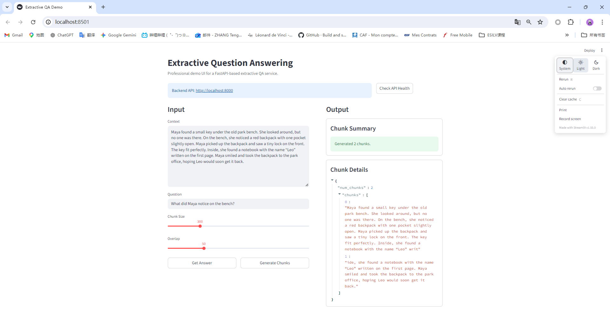

# MLOps - Extractive Question Answering (BERT)

This project builds an **extractive Question Answering** system using **BERT fine-tuned on SQuAD**, then serves it via **FastAPI** and ships it with **Docker**.

---

## 1 Project Overview

**Goal:** Given a *question* and a *context paragraph*, return the **answer span** extracted from the context.

**Why this project:** It demonstrates an end-to-end workflow that includes:
- reproducible environment & dependencies
- training + evaluation
- model artifact management
- API serving
- containerization
- CI/testing hooks

Pipeline (high-level):
SQuAD dataset → preprocessing/tokenization → BERT QA training on Colab GPU → save model artifacts (all artifacts in one Google Drive) → download `models/best/` to local → FastAPI loads model → Docker

**Detailed pipeline supplement:**
1. Use `uv` to create a reproducible Python environment from `pyproject.toml` and `uv.lock`.
2. Load **SQuAD v1** with Hugging Face `datasets`.
3. Convert raw `(question, context, answer_start, answer_text)` samples into tokenized training/evaluation features.
4. Fine-tune `bert-base-uncased` for extractive QA with Hugging Face `Trainer`.
5. Track experiments, hyperparameters, metrics, configs, and model artifacts with **MLflow**.
6. Run a controlled sweep using `configs/train.yaml` + `configs/sweep.yaml` + `scripts/sweep.py`.
7. Compare runs by **F1 (primary)** and **EM (secondary)**, then promote the best checkpoint into the canonical best-model folder.
8. Copy or download the promoted best model to the serving path used by the API.
9. Serve inference through **FastAPI** endpoints such as `/health`, `/qa`, and `/chunks`.
10. Package the service with **Docker**, and optionally launch the API + Streamlit demo together via `docker compose`.

### 1.1 Backend workflow and usage

#### 1.1.1 Training

🐱 On Colab (GPU)

Open `notebooks/colab_train.ipynb` in Colab and use it as the main GPU training entry.

What to modify before running:
- Mount Google Drive first, so all saved checkpoints, reports, and MLflow outputs persist after the Colab session ends.
- Set the project root / artifact root to your Drive folder.
- Make sure the training config points to the correct artifact output directory.
- Make sure the MLflow tracking URI uses the file-store inside the same Drive location if you want the UI and run history to persist.

>📚 In this project, **All artifacts** is save to a single Google Drive folder: **https://drive.google.com/drive/folders/10aV6fYGGOgDyS4CmPr3TiVpQJ7fiwEjA?usp=drive_link**

Recommended Colab run flow:
1. Open `notebooks/colab_train.ipynb`.
2. Enable GPU in Colab runtime.
3. Mount Google Drive.
4. Install dependencies.
5. Update the paths used in the notebook so that:
   - training outputs go to `.../artifacts/`
   - best model is promoted into `.../artifacts/models/best/`
   - MLflow file-store goes to `.../mlruns/`
6. Run the training sweep.
7. After training finishes, evaluate the best model with `eval_cli`.
8. Optionally launch MLflow UI in Colab to inspect runs.

🐱 Locally

If you want to run the training / evaluation workflow locally, use the following commands.

```bash
# 1) clone the repository
git clone <your-repo-url>
cd extractive-qa-mlops-main

# 2) install dependencies
uv sync --dev

# 3) run tests first
uv run pytest

# 4) run a local training sweep
uv run python scripts/sweep.py   --train configs/train.yaml   --sweep configs/sweep.yaml   --train_entry extractive_qa_mlops.train

# 5) evaluate the best local model
uv run python -m extractive_qa_mlops.eval_cli   --model_dir artifacts/models/best   --dataset squad   --samples 500
```

You can also run a single training config directly:

```bash
uv run python -m extractive_qa_mlops.train --config configs/train.yaml
```

#### 1.1.2 Local API and UI startup

After the best model has been downloaded from Google Drive into the expected local serving folder, start the local services with:

```bash
uv run python -m uvicorn extractive_qa_mlops.api:app --reload --host 127.0.0.1 --port 8000
uv run streamlit run .\ui\streamlit_app.py
```

#### 1.1.3 API serving validation

Once the best model is available in the expected serving folder, start the API and test it with a sample request:

```bash
curl -X POST "http://127.0.0.1:8000/qa"   -H "Content-Type: application/json"   -d '{
    "question": "What is the capital of France?",
    "context": "France is a country in Europe. Paris is the capital of France."
  }'
```

Expected response structure:

```json
{
  "answer": "Paris",
  "score": 0.99,
  "start": 0,
  "end": 5,
  "model_path": "...",
  "settings": {
    "max_context_chars": 4000,
    "max_answer_chars": 200,
    "inference_max_length": 512
  }
}
```

#### 1.1.4 Docker-based run path

```bash
docker compose -f docker/docker-compose.yml up --build
```

This starts:
- the FastAPI service for prediction,
- the Streamlit UI for manual demonstration.

### 1.2 Frontend demo

A simple Streamlit-based frontend is provided for manual demonstration.

Users can paste any context paragraph into the webpage, type a free-form question, and submit the request to the backend QA API.
The system then returns the extracted answer span and related prediction information, making it easy for customers or reviewers to interact with the model without calling the API manually.


---

## 2 Problem Definition & Data

### 2.1  Task
This is a span-prediction problem. The model does not generate new text; instead, it identifies the most likely start and end positions of the answer inside the provided context. Therefore, the quality of the final answer depends heavily on whether the gold answer is actually present in the context and whether the preprocessing pipeline correctly aligns character spans with token spans.

- Input: `question`, `context`
- Output: `answer_text`, `start_char`, `end_char`, and a confidence score

### 2.2 Dataset

> 📚 Dataset we use is: **SQuAD v1 (Stanford Question Answering Dataset)**

SQuAD v1 is a strong baseline dataset for extractive QA because every training example contains an answer span inside the context. That makes it suitable for demonstrating preprocessing, span alignment, validation metrics, model selection, and inference serving without introducing the extra uncertainty of unanswerable questions.

Data split: Train / Validation (standard split provided by dataset)

---

## 3 System Architecture

### 3.1 Repository Structure

```txt
extractive-qa-mlops-main/
├── .github/
│   └── workflows/
│       └── ci.yml
├── artifacts/                   # saved MLflow runs, experiment outputs, and best model
│   ├── mlruns/
│   │   └── .gitkeep
│   └── models/
│       ├── best/
│       │   ├── checkpoints/
│       │   │   └── .gitkeep
│       │   ├── reports/
│       │   │   └── error_cases.json
│       │   ├── MODEL_CARD.md
│       │   ├── config.json
│       │   ├── metadata.json
│       │   ├── model.example.afetensors
│       │   ├── special_tokens_map.json
│       │   ├── tokenizer.json
│       │   ├── tokenizer_config.json
│       │   └── vocab.txt
│       ├── experiments/
│       │   ├── 20260212-214048_bert-base-uncased_lr3e-5_bs8_e1_l384_s128/
│       │   │   └── MODEL_CARD.md
│       │   ├── 20260212-222309_bert-base-uncased_lr2e-5_bs8_e1_l384_s128/
│       │   │   └── MODEL_CARD.md
│       │   ├── 20260212-230516_bert-base-uncased_lr5e-5_bs8_e1_l384_s128/
│       │   │   └── MODEL_CARD.md
│       │   ├── 20260212-234752_bert-base-uncased_lr3e-5_bs8_e2_l384_s128/
│       │   │   └── MODEL_CARD.md
│       │   ├── 20260213-010813_bert-base-uncased_lr3e-5_bs8_e1_l512_s128/
│       │   │   └── MODEL_CARD.md
│       │   └── 20260213-020320_bert-base-uncased_lr3e-5_bs8_e1_l384_s64/
│       │       └── MODEL_CARD.md
│       ├── experiment_em_f1_comparison.png
│       └── experiment_summary.md
├── configs/                     # training, sweep, serving, and MLflow config files
│   ├── mlflow.example.yaml
│   ├── serve.yaml
│   ├── sweep.yaml
│   └── train.yaml
├── docker/                      # Dockerfile and docker-compose setup
│   ├── Dockerfile
│   └── docker-compose.yml
├── notebooks/                   # Colab notebook for GPU training
│   └── colab_train.ipynb
├── scripts/                     # helper scripts such as the sweep entry
│   └── sweep.py                 # multi-run orchestration
├── src/                         # core training, evaluation, serving, and utility code
│   └── extractive_qa_mlops/
│       ├── __init__.py
│       ├── api.py               # FastAPI endpoints
│       ├── best_model.py
│       ├── data.py              # dataset loading and preprocessing
│       ├── eval_cli.py          # evaluate the final best local model
│       ├── evaluate.py          # evaluating
│       ├── mlflow.py
│       ├── paths.py             # Path Interface
│       ├── serve.py             # model loading and inference logic
│       ├── text_utils.py
│       └── train.py             # traning
├── tests/                       # unit tests for data, evaluation, API, and serving
│   ├── test_api.py
│   ├── test_best_model.py
│   ├── test_data_module.py
│   ├── test_evaluate_new.py
│   ├── test_load.py
│   ├── test_mlflow_wrapper.py
│   ├── test_serve.py
│   └── test_text_utils.py
├── ui/                          # Streamlit demo frontend
│   └── streamlit_app.py
├── .gitignore
├── .pre-commit-config.yaml
├── .python-version
├── README.md
├── pyproject.toml
├── requirements.txt
├── uv.lock
└── uvicorn
```

### 3.2 Data & preprocessing

The data pipeline loads **SQuAD** and prepares question-context pairs for extractive QA training and evaluation.

- **Input preparation:** questions are lightly normalized by stripping extra spaces.
- **Tokenization:** question-context pairs are tokenized with a Hugging Face fast tokenizer using `truncation="only_second"`.
- **Long-context handling:** long contexts are split into overlapping windows so answer spans are less likely to be truncated.
- **Training labels:** character-level answer spans are converted into token-level start and end positions.
- **Evaluation support:** feature-to-example mapping and valid context offsets are kept so model outputs can be post-processed back into final answer text.

### 3.3 Training

Training is executed through a sweep-based workflow rather than a single fixed run.

- **Sweep control:** `scripts/sweep.py` reads `configs/train.yaml` as the baseline config and `configs/sweep.yaml` as the experiment definition file.
- **Config merging:** for each experiment, the sweep script merges the baseline config with experiment-specific overrides and writes a temporary merged config.
- **Run launching:** each merged config is passed to the training entrypoint, so experiments are executed one by one in a controlled and reproducible way.
- **Model training:** each run loads the tokenizer and pretrained QA model, builds tokenized train/eval features, and fine-tunes the model on SQuAD.
- **Validation and metrics:** after training, validation predictions are post-processed into answer strings and evaluated with **EM** and **F1**.
- **Tracking and promotion:** checkpoints, metadata, and reports are logged to **MLflow**, and the best-performing run is promoted to `artifacts/models/best/`.

### 3.4 Artifact management (Google Drive)

All training outputs are stored under a single Google Drive folder so that they persist across Colab sessions.
We keep **two top-level folders**:

- `artifacts/` — human-friendly training outputs (models, reports, experiment notes)
- `mlruns/` — MLflow **file store** (runs/metrics/params + logged artifacts)

**Drive layout:**
```txt
<extractive-qa-mlops>/
├─ artifacts/
│  └─ models/
│     ├─ best/
│     │  ├─ checkpoints/
│     │  ├─ reports/
│     │  │  └─ error_cases.json
│        │  ├─ config.json
│     │  ├─ MODEL_CARD.md
│     │  ├─ metadata.json
│     │  └─ model.safetensors + tokenizer files (tokenizer.json, vocab.txt, ...)
│     └─ experiments/
│        ├─ <run_name_1>/
│        │  ├─ checkpoints/
│        │  ├─ reports/
│        │  │  └─ error_cases.json
│        │  ├─ config.json
│        │  ├─ MODEL_CARD.md
│        │  ├─ metadata.json
│        │  └─ model.safetensors + tokenizer files
│        └─ <run_name_2>/ ...
└─ mlruns/
   └─ <experiment_id>/
      ├─ meta.yaml
      └─ <run_id>/
         ├─ metrics/
         ├─ params/
         ├─ tags/
         ├─ meta.yaml
         └─ artifacts/   (e.g., model/...)
```

**Best model management:** each run keeps its own artifacts and is logged to MLflow. After training, the run is compared with the current best model using **F1 first** and **EM second**. If it is better, `artifacts/models/best/` is updated so serving always uses the promoted best checkpoint.

**MLflow experiment tracking:** The following screenshots show our MLflow tracking UI.


*MLflow runs overview across multiple BERT fine-tuning experiments.*


*Detailed MLflow run page showing logged metrics, parameters, and run metadata.*

### 3.5 Local inference

After the promoted best model is downloaded from Google Drive into the expected local serving folder, FastAPI loads it at startup and serves inference requests locally.


The local inference flow is straightforward: the service reads the promoted checkpoint, loads the tokenizer and QA model during startup, and keeps them ready for prediction. When `/qa` receives a request, the API validates the payload, applies context-length limits, tokenizes the question-context pair, runs inference, decodes the predicted answer span, and returns the answer text, score, span indices, and serving metadata. The `/chunks` endpoint can also be used to inspect how long contexts are split before inference-related processing.

**Local demo UI:** For easier manual testing, we also provide a Streamlit-based frontend connected to the FastAPI backend. Users can paste a context paragraph, enter a question, adjust chunking settings, and inspect the returned output interactively.


*Streamlit frontend connected to the FastAPI backend for local QA demo and chunk inspection.*

### 3.6 Containerization

Docker provides a consistent way to run the inference service across environments.

The Docker image packages the repository, installs the serving dependencies, and sets the runtime environment needed by the application. By default, the container starts the FastAPI service with `uvicorn`, while Docker Compose can be used to launch both the API and the Streamlit UI together for local demo usage. This keeps runtime behavior more consistent across machines and makes demo or deployment setup simpler.

---

## 4 MLOps Practices

This repository is designed to follow the course expectations around reproducibility, experiment tracking, serving, containerization, testing, and collaborative development.

## 4 MLOps Practices

This repository is designed to follow the course expectations around reproducibility, automated testing, CI, and collaborative development. The project uses a lockfile-based environment, config-driven training and serving, and an automated GitHub workflow so that code quality and basic reliability checks are applied consistently during development.

### 4.1 Reproducible environment

Dependencies are declared in `pyproject.toml` and locked in `uv.lock`, with Python `>=3.11` as the supported runtime. Environment setup is managed with `uv`, and both training and serving are driven by explicit configuration files rather than hard-coded settings. This makes the project easier to reproduce across teammates, machines, and evaluation environments.

### 4.2 Version control and CI workflow

Development follows a branch-and-PR workflow. Direct modification of `main` is disabled, and pull requests must pass CI before they can be merged. The CI pipeline runs automatically on both **push to `main`** and **pull requests targeting `main`**, installs dependencies, runs `pre-commit`, and then runs `pytest`.

### 4.3 Testing and code quality

Testing and code quality checks are automated rather than manual.

- `pre-commit` is used for whitespace/file sanity checks, YAML/TOML validation, large-file checks, and Ruff linting/formatting.
- `pytest` runs automatically in CI, with coverage enabled for `src/` and a minimum threshold of **60%**.
- The current test baseline covers API behavior, data/preprocessing, evaluation, model loading, serving logic, best-model selection, MLflow integration, and text utilities.

---

## 5 Monitoring & Reliability

This project uses a lightweight monitoring and reliability baseline aligned with its scope.

- **Training and experiment tracking:** dataset-profile statistics such as sample counts, feature counts, and context-length statistics are logged during training, while run metrics are stored in MLflow for experiment comparison.
- **Service availability:** the API exposes a `/health` endpoint so availability can be checked quickly during testing or deployment.
- **Input robustness:** requests are validated with Pydantic, and serving limits such as `max_context_chars`, `max_answer_chars`, and `inference_max_length` help prevent unstable or malformed inputs.
- **Inference observability:** structured logs can capture request activity, inference latency, and failure cases, while request length and answer length can be monitored as lightweight quality-drift signals.

Overall, this monitoring baseline is intentionally simple, but it covers availability, observability, and input validation for the current project scope.

---

## 6 Team Collaboration

> 📋 Work is tracked via Git commit history and PR reviews.

| Member | Main responsibility | Main maintained branches |
|---|---|---|
| Tengzhe ZHANG | Data preprocessing, training, and evaluation | `train`<br>`skeleton-building`<br>`final-cleanup` |
| Rajagopal Gajendra Deepthi | Serving | `api` |
| Mourad Reda | Docker, CI, CD, and monitoring | `add-ci`<br>`precommit-tests` |

---

## 7 Limitations & Future Work

### 7.1 Limitations

This project is built as a reproducible extractive-QA baseline rather than a fully production-ready question answering system. As a result, it inherits several practical limitations from both the task setting and the current implementation.

- The system is **extractive**, so the answer must already appear in the provided context.
- It does **not perform retrieval**, which means users must supply a relevant context paragraph themselves.
- Performance depends on how similar real user inputs are to **SQuAD-style** data.
- Long documents are constrained by tokenizer length and serving limits.
- The returned confidence score is only a simple inference-time signal and is not fully calibrated.

Overall, the current baseline prioritizes reproducible engineering and end-to-end MLOps workflow coverage over state-of-the-art QA accuracy.

### 7.2 Future work

Future improvements can target both model capability and MLOps maturity.

- Add retrieval to fetch relevant contexts automatically instead of relying on manual context input.
- Add better confidence calibration and abstention support for uncertain or unsupported questions.
- Improve monitoring with richer metrics, dashboards, and serving diagnostics.
- Automate model registry and deployment workflows more fully through MLflow.
- Improve span decoding and post-processing, such as n-best aggregation, tighter length constraints, and better normalization, to reduce boundary errors and narrow the EM–F1 gap.

## 8 Demo link
>🎥 You can check our project demo through this link: https://youtu.be/9nDR2G0vMOE?feature=shared
---
