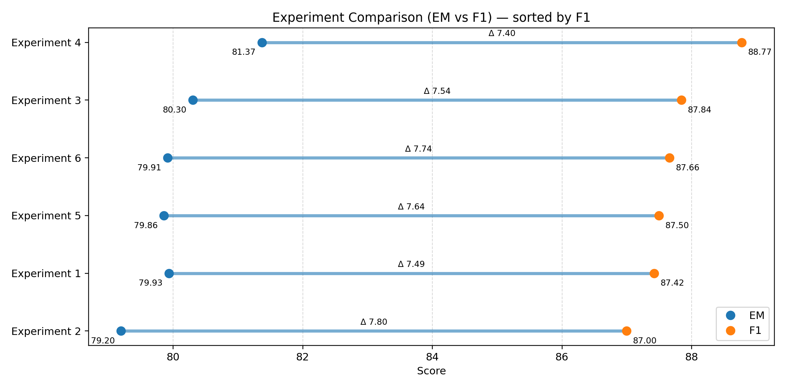

# Experiment summary

This page compares **6 training experiments** based on the validation metrics recorded in each `MODEL_CARD*.md` and the small subset of validation exemple in each `error_cases*.json`.

**Best overall (by F1): Exp (4)** — epochs=2 with **EM 81.37 / F1 88.77**.

## Results table

| experiment   | change         |    EM |    F1 |   ΔEM |   ΔF1 |   learning_rate |   epochs |   max_length |   doc_stride |
|:-------------|:---------------|------:|------:|------:|------:|----------------:|---------:|-------------:|-------------:|
| (4)          | epochs=2       | 81.37 | 88.77 |  1.44 |  1.35 |           3e-05 |        2 |          384 |          128 |
| (3)          | lr=5e-05       | 80.3  | 87.84 |  0.37 |  0.42 |           5e-05 |        1 |          384 |          128 |
| (6)          | doc_stride=64  | 79.91 | 87.66 | -0.02 |  0.23 |           3e-05 |        1 |          384 |           64 |
| (5)          | max_length=512 | 79.86 | 87.5  | -0.08 |  0.07 |           3e-05 |        1 |          512 |          128 |
| (1)          | baseline       | 79.93 | 87.42 |  0    |  0    |           3e-05 |        1 |          384 |          128 |
| (2)          | lr=2e-05       | 79.2  | 87    | -0.74 | -0.42 |           2e-05 |        1 |          384 |          128 |

Notes:
- `ΔEM/ΔF1` are deltas vs **baseline = Exp (1)**.
- All experiments use **bert-base-uncased**, dataset **SQuAD**, fp16=True, seed=42, batch_size(train)=8.

## Visualizations

### EM vs F1

## Sampled correctness (EM) snapshot

| Experiment   |   Sampled |   Incorrect (EM) |   EM on sampled (%) | Most common worst-case error   |
|:-------------|----------:|-----------------:|--------------------:|:-------------------------------|
| Exp (1)      |        30 |               11 |               63.33 | Partial span (too short)       |
| Exp (2)      |        30 |               10 |               66.67 | Partial span (too short)       |
| Exp (3)      |        30 |               11 |               63.33 | Partial span (too short)       |
| Exp (4)      |        30 |               10 |               66.67 | Partial span (too short)       |
| Exp (5)      |        30 |               12 |               60    | Partial span (too short)       |
| Exp (6)      |        30 |                9 |               70    | Partial span (too short)       |

## Worst-case error type distribution

| Error type                |   Count |   Share (%) |
|:--------------------------|--------:|------------:|
| Partial span (too short)  |      25 |        42.4 |
| Partial span (too long)   |      20 |        33.9 |
| Wrong answer (no overlap) |      14 |        23.7 |

## Representative high-confidence failures

<strong>Exp (1)</strong> — Partial span (too short) (confidence 0.968)

- **Question:** Which religion did Kublai prefer?
- **Gold:** Buddhism, especially the Tibetan variants
- **Pred:** Buddhism
- **ID:** `57287fec4b864d1900164a3d`

<strong>Exp (2)</strong> — Partial span (too short) (confidence 0.943)

- **Question:** Which religion did Kublai prefer?
- **Gold:** Buddhism, especially the Tibetan variants
- **Pred:** Buddhism
- **ID:** `57287fec4b864d1900164a3d`

<strong>Exp (3)</strong> — Partial span (too short) (confidence 0.950)

- **Question:** Which religion did Kublai prefer?
- **Gold:** Buddhism, especially the Tibetan variants
- **Pred:** Buddhism
- **ID:** `57287fec4b864d1900164a3d`

<strong>Exp (4)</strong> — Partial span (too short) (confidence 0.969)

- **Question:** Which religion did Kublai prefer?
- **Gold:** Buddhism, especially the Tibetan variants
- **Pred:** Buddhism
- **ID:** `57287fec4b864d1900164a3d`

<strong>Exp (5)</strong> — Partial span (too short) (confidence 0.918)

- **Question:** Which religion did Kublai prefer?
- **Gold:** Buddhism, especially the Tibetan variants
- **Pred:** Buddhism
- **ID:** `57287fec4b864d1900164a3d`

<strong>Exp (6)</strong> — Partial span (too short) (confidence 0.929)

- **Question:** Which religion did Kublai prefer?
- **Gold:** Buddhism, especially the Tibetan variants
- **Pred:** Buddhism
- **ID:** `57287fec4b864d1900164a3d`

## Takeaways

- Increasing **epochs to 2** (**Exp (4)**) delivered the largest gain over baseline (**+1.35 F1**, **+1.44 EM**) and is the new best setting (**EM 81.37 / F1 88.77**).
- A higher **learning rate (5e-5)** (**Exp (3)**) improved both metrics modestly (**+0.42 F1**, **+0.37 EM**), while a lower **learning rate (2e-5)** (**Exp (2)**) hurt performance the most (**−0.42 F1**, **−0.74 EM**).
- Windowing changes (**doc_stride=64** or **max_length=512**) produced only small metric shifts (≤ **+0.23 F1**, no EM gain), so they’re lower priority than training longer.
- Error cases are dominated by **span boundary mistakes** (answers **too short/too long**), suggesting next improvements should target **span decoding / post-processing** to close the EM–F1 gap.
